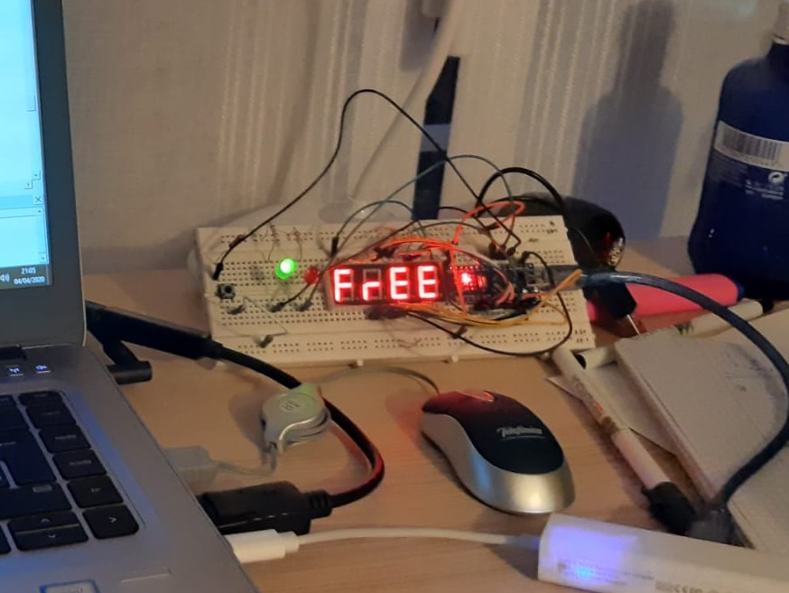
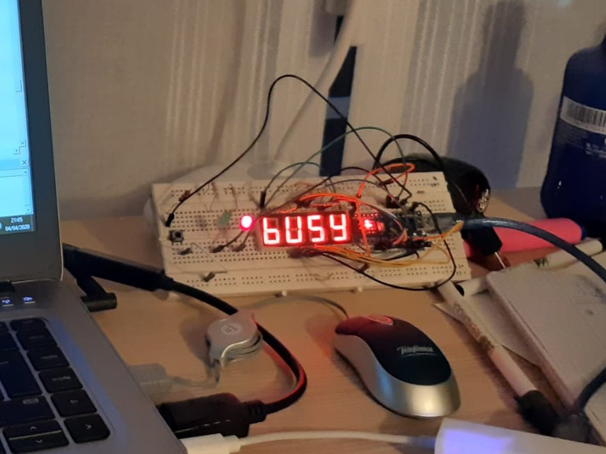

# busyFree
Simple Busy / Free indicator

During COVID-19 confinement, having to work from home with 2 bored kids around, there are many times in which during a conf call one of the 2 kids (or both) comes around asking what is for lunch, complaining about his brother bothering him or just asking for attention. This device will let them know I am busy and hopefully will reduce the undesired interruptions.

Created using leftover parts from other projects: an Arduino Nano, 7 Segment 4 Digit LED Display SMA420564, a couple LEDs (Green/Red), a push button, some resistors and wires.

This is just a "bored afternoon project", done with whatever I could find at home from old abandoned projects.

